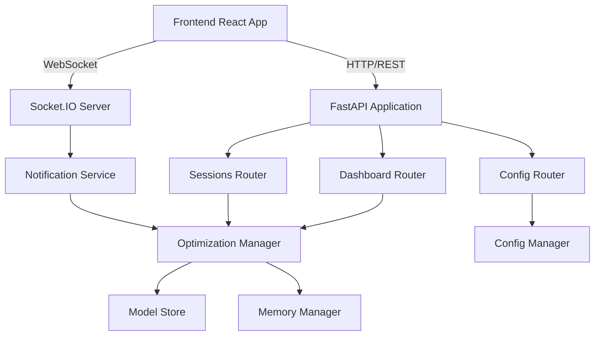

# Design Document

## Overview

This design document details the implementation of missing REST API endpoints and WebSocket support for the Robotics Model Optimization Platform. The frontend application is currently making requests to endpoints that don't exist, resulting in 404 errors. This implementation will complete the API layer to provide full frontend-backend integration.

## Architecture

### API Layer Architecture



### Component Integration

The new endpoints will integrate with existing platform components:
- **OptimizationManager**: Provides session data and statistics
- **ModelStore**: Provides model count and metadata
- **MemoryManager**: Provides session history and persistence
- **NotificationService**: Provides real-time updates via WebSocket
- **ConfigManager**: Manages optimization criteria configuration

## Components and Interfaces

### Dashboard Statistics Endpoint

**Endpoint**: `GET /dashboard/stats`

**Purpose**: Provide aggregate statistics for the dashboard view

**Response Schema**:
```python
class DashboardStats(BaseModel):
    total_models: int
    active_optimizations: int
    completed_optimizations: int
    failed_optimizations: int
    average_size_reduction: float  # percentage
    average_speed_improvement: float  # percentage
    total_sessions: int
    last_updated: datetime
```

**Implementation Logic**:
1. Query ModelStore for total model count
2. Query OptimizationManager for active session count
3. Query MemoryManager for completed/failed session counts
4. Calculate averages from completed session results
5. Return aggregated statistics

**Error Handling**:
- Return 500 if database query fails
- Return partial data with warnings if some queries fail
- Log all errors for debugging

### Optimization Sessions List Endpoint

**Endpoint**: `GET /optimization/sessions`

**Purpose**: List all optimization sessions with filtering and pagination

**Query Parameters**:
- `status`: Filter by session status (running, completed, failed, cancelled)
- `model_id`: Filter by specific model
- `start_date`: Filter sessions created after this date
- `end_date`: Filter sessions created before this date
- `skip`: Pagination offset (default: 0)
- `limit`: Pagination limit (default: 50, max: 100)

**Response Schema**:
```python
class OptimizationSessionSummary(BaseModel):
    session_id: str
    model_id: str
    model_name: str
    status: str
    progress_percentage: float
    techniques: List[str]
    size_reduction_percent: Optional[float]
    speed_improvement_percent: Optional[float]
    created_at: datetime
    updated_at: datetime
    completed_at: Optional[datetime]

class SessionListResponse(BaseModel):
    sessions: List[OptimizationSessionSummary]
    total: int
    skip: int
    limit: int
```

**Implementation Logic**:
1. Parse and validate query parameters
2. Query MemoryManager with filters
3. Enrich session data with model names from ModelStore
4. Apply pagination
5. Return paginated results with total count

**Error Handling**:
- Return 400 for invalid query parameters
- Return 500 for database errors
- Return empty list if no sessions match filters

### Configuration Endpoints

**Endpoint**: `GET /config/optimization-criteria`

**Purpose**: Retrieve current optimization criteria configuration

**Response Schema**:
```python
class OptimizationCriteriaResponse(BaseModel):
    name: str
    description: str
    constraints: OptimizationConstraints
    target_deployment: str
    enabled_techniques: List[str]
    hardware_target: str
    max_size_reduction_percent: float
    min_accuracy_retention_percent: float
    max_inference_time_ms: int
    created_at: datetime
    updated_at: datetime
```

**Endpoint**: `PUT /config/optimization-criteria`

**Purpose**: Update optimization criteria configuration

**Request Schema**: Same as OptimizationCriteriaResponse (without timestamps)

**Implementation Logic**:
1. Load current configuration from ConfigManager
2. Validate new configuration values
3. Check for conflicts or invalid combinations
4. Update configuration in ConfigManager
5. Persist changes to database
6. Return updated configuration

**Error Handling**:
- Return 400 for validation errors with detailed messages
- Return 409 for conflicting configuration values
- Return 500 for persistence errors
- Rollback changes on failure

### WebSocket Integration

**Endpoint**: WebSocket connection at `/socket.io`

**Purpose**: Provide real-time updates for optimization progress

**Event Types**:

1. **Connection Events**:
   - `connect`: Client connected successfully
   - `disconnect`: Client disconnected
   - `connect_error`: Connection failed

2. **Session Events**:
   - `session_started`: New optimization session started
   - `session_progress`: Progress update for running session
   - `session_completed`: Session completed successfully
   - `session_failed`: Session failed with error
   - `session_cancelled`: Session cancelled by user

3. **System Events**:
   - `system_status`: Platform health and status updates
   - `alert`: Important system alerts or warnings

**Event Schemas**:
```python
class SessionStartedEvent(BaseModel):
    session_id: str
    model_id: str
    model_name: str
    techniques: List[str]
    timestamp: datetime

class SessionProgressEvent(BaseModel):
    session_id: str
    progress_percentage: float
    current_step: str
    estimated_completion: Optional[datetime]
    timestamp: datetime

class SessionCompletedEvent(BaseModel):
    session_id: str
    results: OptimizationResults
    timestamp: datetime

class SessionFailedEvent(BaseModel):
    session_id: str
    error_message: str
    error_type: str
    timestamp: datetime
```

**Implementation Strategy**:
1. Integrate python-socketio with FastAPI
2. Create WebSocket manager to handle connections
3. Subscribe to NotificationService events
4. Broadcast events to connected clients
5. Implement room-based subscriptions for specific sessions
6. Handle reconnection and state synchronization

**Connection Management**:
- Track connected clients and their subscriptions
- Implement heartbeat/ping-pong for connection health
- Handle graceful disconnection and cleanup
- Support multiple concurrent connections per user

## Data Models

### Dashboard Statistics Model
```python
@dataclass
class DashboardStatistics:
    total_models: int
    active_optimizations: int
    completed_optimizations: int
    failed_optimizations: int
    average_size_reduction: float
    average_speed_improvement: float
    total_sessions: int
    last_updated: datetime
    
    @classmethod
    def from_platform_data(cls, 
                          model_store: ModelStore,
                          optimization_manager: OptimizationManager,
                          memory_manager: MemoryManager) -> 'DashboardStatistics':
        """Calculate statistics from platform components"""
        pass
```

### Session Filter Model
```python
@dataclass
class SessionFilter:
    status: Optional[str] = None
    model_id: Optional[str] = None
    start_date: Optional[datetime] = None
    end_date: Optional[datetime] = None
    skip: int = 0
    limit: int = 50
    
    def validate(self) -> None:
        """Validate filter parameters"""
        if self.limit > 100:
            raise ValueError("Limit cannot exceed 100")
        if self.skip < 0:
            raise ValueError("Skip must be non-negative")
        if self.status and self.status not in VALID_STATUSES:
            raise ValueError(f"Invalid status: {self.status}")
```

### Configuration Manager
```python
class ConfigurationManager:
    """Manages optimization criteria configuration"""
    
    def __init__(self, config_path: str):
        self.config_path = config_path
        self.current_config: Optional[OptimizationCriteria] = None
        self._lock = threading.Lock()
    
    def load_config(self) -> OptimizationCriteria:
        """Load configuration from storage"""
        pass
    
    def save_config(self, config: OptimizationCriteria) -> None:
        """Save configuration to storage"""
        pass
    
    def validate_config(self, config: OptimizationCriteria) -> ValidationResult:
        """Validate configuration values"""
        pass
    
    def get_current_config(self) -> OptimizationCriteria:
        """Get current active configuration"""
        pass
    
    def update_config(self, config: OptimizationCriteria) -> OptimizationCriteria:
        """Update configuration with validation"""
        pass
```

### WebSocket Manager
```python
class WebSocketManager:
    """Manages WebSocket connections and event broadcasting"""
    
    def __init__(self, sio: socketio.AsyncServer):
        self.sio = sio
        self.connections: Dict[str, Set[str]] = {}  # user_id -> set of session_ids
        self.notification_service: Optional[NotificationService] = None
    
    async def connect_client(self, sid: str, user_id: str) -> None:
        """Handle new client connection"""
        pass
    
    async def disconnect_client(self, sid: str) -> None:
        """Handle client disconnection"""
        pass
    
    async def subscribe_to_session(self, sid: str, session_id: str) -> None:
        """Subscribe client to session updates"""
        pass
    
    async def broadcast_event(self, event_type: str, data: Dict[str, Any], 
                             session_id: Optional[str] = None) -> None:
        """Broadcast event to relevant clients"""
        pass
    
    def setup_notification_handlers(self, notification_service: NotificationService) -> None:
        """Set up handlers for notification service events"""
        pass
```

## Error Handling

### Error Response Format
```python
class ErrorResponse(BaseModel):
    error: str  # Error type/code
    message: str  # Human-readable message
    details: Optional[Dict[str, Any]] = None  # Additional error details
    timestamp: datetime
    request_id: str  # For tracking and debugging
```

### Error Categories

1. **Validation Errors (400)**:
   - Invalid query parameters
   - Invalid configuration values
   - Missing required fields

2. **Authentication Errors (401)**:
   - Missing authentication token
   - Invalid or expired token

3. **Authorization Errors (403)**:
   - Insufficient permissions
   - Access denied to resource

4. **Not Found Errors (404)**:
   - Session not found
   - Model not found
   - Configuration not found

5. **Conflict Errors (409)**:
   - Conflicting configuration values
   - Concurrent modification conflicts

6. **Server Errors (500)**:
   - Database connection failures
   - Internal service errors
   - Unexpected exceptions

### Error Handling Strategy

- Log all errors with full context and stack traces
- Return user-friendly error messages
- Include request IDs for error tracking
- Implement retry logic for transient failures
- Gracefully degrade when services are unavailable

## Testing Strategy

### Unit Tests

1. **Endpoint Tests**:
   - Test each endpoint with valid inputs
   - Test with invalid inputs and edge cases
   - Test authentication and authorization
   - Test error handling and responses

2. **WebSocket Tests**:
   - Test connection establishment and disconnection
   - Test event broadcasting and delivery
   - Test room-based subscriptions
   - Test reconnection handling

3. **Configuration Tests**:
   - Test configuration validation
   - Test configuration persistence
   - Test concurrent configuration updates
   - Test rollback on errors

### Integration Tests

1. **End-to-End API Tests**:
   - Test complete workflows through API
   - Test frontend-backend integration
   - Test WebSocket event flow
   - Test error scenarios and recovery

2. **Performance Tests**:
   - Test API response times under load
   - Test WebSocket scalability with many connections
   - Test database query performance
   - Test concurrent request handling

### Manual Testing

1. **Frontend Integration**:
   - Verify dashboard loads with correct data
   - Verify session list displays properly
   - Verify configuration updates work
   - Verify real-time updates appear correctly

2. **WebSocket Testing**:
   - Verify connection status indicator
   - Verify progress updates in real-time
   - Verify reconnection after disconnect
   - Verify multiple browser tabs work correctly

## Security Considerations

### Authentication
- All endpoints require valid JWT tokens
- Tokens expire after configurable duration
- Refresh token mechanism for long sessions

### Authorization
- Role-based access control (RBAC)
- Admin-only endpoints for configuration
- User can only access their own sessions

### Input Validation
- Validate all query parameters
- Sanitize user inputs
- Prevent SQL injection
- Prevent XSS attacks

### Rate Limiting
- Implement rate limiting per user
- Prevent API abuse
- Throttle WebSocket connections

### CORS Configuration
- Configure allowed origins
- Restrict to known frontend domains in production
- Allow credentials for authenticated requests

## Deployment Considerations

### Environment Configuration
- Separate configs for dev/staging/prod
- Environment variables for sensitive data
- Configuration validation on startup

### Monitoring
- Log all API requests and responses
- Track WebSocket connection metrics
- Monitor endpoint performance
- Alert on error rate spikes

### Scalability
- Stateless API design for horizontal scaling
- WebSocket sticky sessions for load balancing
- Database connection pooling
- Caching for frequently accessed data

### Documentation
- Auto-generated OpenAPI/Swagger docs
- Example requests and responses
- Authentication instructions
- WebSocket event documentation
