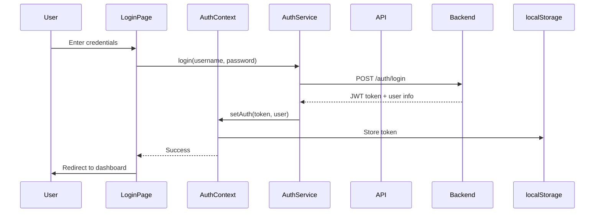
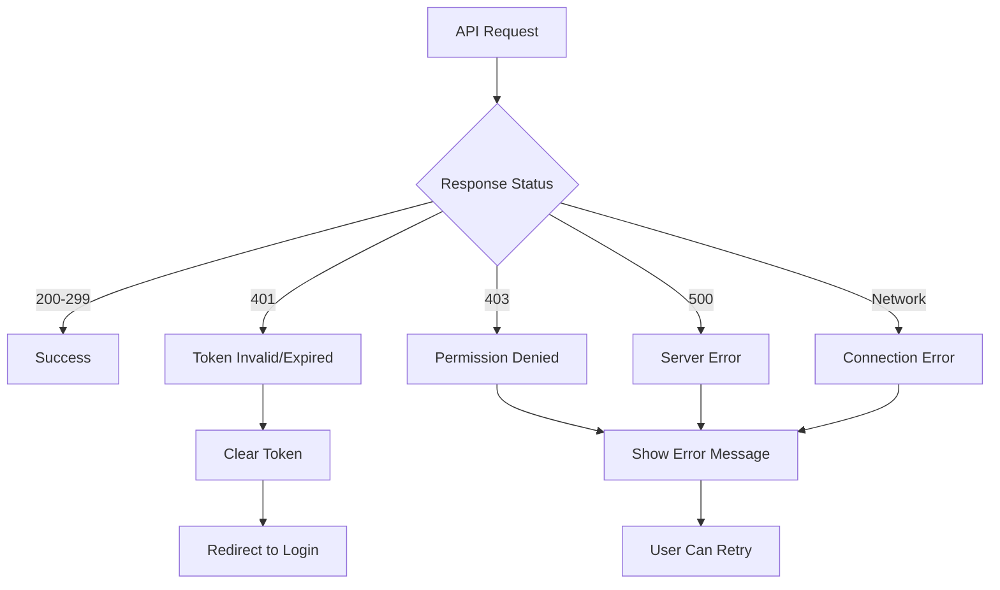

# Design Document - Frontend Authentication

## Overview

This design implements a complete authentication system for the React frontend, enabling secure access to protected API endpoints and real-time WebSocket updates. The solution integrates with the existing backend JWT authentication system and follows React best practices using hooks and context.

**Key Design Principles:**
- Seamless integration with existing backend authentication
- Secure token storage and management
- Automatic token refresh and expiration handling
- User-friendly error messages and feedback
- Minimal impact on existing codebase

## Architecture

### Component Structure

```
frontend/src/
├── components/
│   ├── auth/
│   │   ├── LoginPage.tsx          # Login form component
│   │   ├── ProtectedRoute.tsx     # Route guard component
│   │   └── UserMenu.tsx           # User info and logout
│   └── layout/
│       └── Header.tsx             # Updated with auth status
├── contexts/
│   └── AuthContext.tsx            # Authentication state management
├── services/
│   ├── api.ts                     # Updated with auth interceptors
│   └── auth.ts                    # Authentication service
├── hooks/
│   └── useAuth.ts                 # Custom auth hook
└── types/
    └── auth.ts                    # Auth-related TypeScript types
```

### Data Flow



## Components and Interfaces

### 1. AuthContext

**Purpose:** Centralized authentication state management using React Context API

**Interface:**
```typescript
interface AuthContextType {
  user: User | null;
  token: string | null;
  isAuthenticated: boolean;
  isLoading: boolean;
  login: (username: string, password: string) => Promise<void>;
  logout: () => void;
  refreshToken: () => Promise<void>;
}

interface User {
  id: string;
  username: string;
  role: string;
  email?: string;
}
```

**Key Features:**
- Manages authentication state globally
- Provides login/logout functions
- Handles token refresh
- Persists state across page reloads


### 2. AuthService

**Purpose:** Handles authentication API calls and token management

**Interface:**
```typescript
class AuthService {
  login(username: string, password: string): Promise<LoginResponse>;
  logout(): void;
  getToken(): string | null;
  setToken(token: string): void;
  removeToken(): void;
  isTokenValid(): boolean;
  getTokenExpiration(): Date | null;
}

interface LoginResponse {
  access_token: string;
  token_type: string;
  expires_in: number;
  user: User;
}
```

**Key Features:**
- Communicates with backend /auth/login endpoint
- Manages token storage in localStorage
- Validates token expiration
- Provides token for API requests

### 3. API Interceptors

**Purpose:** Automatically add authentication headers to all API requests

**Implementation:**
```typescript
// Request interceptor
axios.interceptors.request.use(
  (config) => {
    const token = AuthService.getToken();
    if (token) {
      config.headers.Authorization = `Bearer ${token}`;
    }
    return config;
  },
  (error) => Promise.reject(error)
);

// Response interceptor
axios.interceptors.response.use(
  (response) => response,
  (error) => {
    if (error.response?.status === 401) {
      // Token expired or invalid
      AuthService.removeToken();
      window.location.href = '/login';
    }
    return Promise.reject(error);
  }
);
```

### 4. ProtectedRoute Component

**Purpose:** Guard routes that require authentication

**Interface:**
```typescript
interface ProtectedRouteProps {
  children: React.ReactNode;
  requiredRole?: string;
}
```

**Behavior:**
- Checks if user is authenticated
- Redirects to login if not authenticated
- Optionally checks user role for admin routes
- Shows loading state while checking auth

### 5. LoginPage Component

**Purpose:** User interface for authentication

**Features:**
- Username and password input fields
- Form validation
- Error message display
- Loading state during authentication
- "Remember Me" option
- Responsive design using Ant Design

### 6. WebSocket Authentication

**Purpose:** Secure WebSocket connections with JWT token

**Implementation:**
```typescript
const socket = io('http://localhost:8000', {
  auth: {
    token: AuthService.getToken()
  },
  transports: ['websocket']
});

socket.on('connect_error', (error) => {
  if (error.message === 'Authentication error') {
    // Handle auth failure
    AuthService.removeToken();
    window.location.href = '/login';
  }
});
```

## Data Models

### Token Storage

**Structure:**
```typescript
interface StoredAuth {
  token: string;
  user: User;
  expiresAt: string; // ISO timestamp
  rememberMe: boolean;
}
```

**Storage Location:** localStorage (key: 'auth')

**Security Considerations:**
- Token stored in localStorage (accessible to JavaScript)
- Alternative: httpOnly cookies (more secure, requires backend changes)
- Token expiration checked on every route change
- Automatic cleanup on logout

### User State

**Structure:**
```typescript
interface AuthState {
  user: User | null;
  token: string | null;
  isAuthenticated: boolean;
  isLoading: boolean;
  error: string | null;
}
```

## Error Handling

### Error Types and Messages

| Error Code | User Message | Action |
|------------|--------------|--------|
| 401 | "Invalid username or password" | Show error on login form |
| 401 (expired) | "Session expired, please log in again" | Redirect to login |
| 403 | "You don't have permission" | Show error message |
| 500 | "Server error, please try again" | Show error message |
| Network | "Unable to connect to server" | Show error message |

### Error Handling Flow



## Testing Strategy

### Unit Tests

1. **AuthContext Tests**
   - Login success/failure
   - Logout functionality
   - Token persistence
   - Token expiration handling

2. **AuthService Tests**
   - API call mocking
   - Token storage/retrieval
   - Token validation

3. **ProtectedRoute Tests**
   - Redirect when not authenticated
   - Allow access when authenticated
   - Role-based access control

### Integration Tests

1. **Login Flow**
   - Complete login process
   - Token storage verification
   - Redirect after login

2. **Protected Routes**
   - Access without authentication
   - Access with authentication
   - Token expiration during session

3. **API Integration**
   - Authenticated requests
   - Token refresh
   - Error handling

### E2E Tests

1. **User Journey**
   - Login → Upload Model → Start Optimization → Logout
   - Session persistence across page refresh
   - Token expiration handling

## Security Considerations

### Token Security

1. **Storage:** localStorage (acceptable for JWT tokens)
2. **Transmission:** Always use HTTPS in production
3. **Expiration:** Respect backend token expiration (60 minutes)
4. **Refresh:** Implement token refresh before expiration

### XSS Protection

1. **Input Sanitization:** Sanitize all user inputs
2. **Content Security Policy:** Configure CSP headers
3. **React Protection:** React automatically escapes content

### CSRF Protection

1. **Token-based Auth:** JWT tokens are not vulnerable to CSRF
2. **SameSite Cookies:** If using cookies, set SameSite attribute

## Performance Considerations

### Optimization Strategies

1. **Lazy Loading:** Load auth components only when needed
2. **Memoization:** Use React.memo for auth-related components
3. **Token Caching:** Cache token validation results
4. **Debouncing:** Debounce token expiration checks

### Bundle Size

- AuthContext: ~2KB
- AuthService: ~3KB
- LoginPage: ~5KB
- Total Impact: ~10KB (minimal)

## Migration Strategy

### Phase 1: Core Authentication (High Priority)
1. Create AuthContext and AuthService
2. Implement LoginPage
3. Add API interceptors
4. Update existing API calls

### Phase 2: Route Protection (High Priority)
1. Create ProtectedRoute component
2. Wrap protected routes
3. Add redirect logic

### Phase 3: WebSocket Auth (High Priority)
1. Update WebSocket connection
2. Add token to connection options
3. Handle auth errors

### Phase 4: UI Enhancements (Medium Priority)
1. Add UserMenu component
2. Update Header with auth status
3. Add logout functionality

### Phase 5: Polish (Low Priority)
1. Add "Remember Me" feature
2. Implement token refresh
3. Add session timeout warnings
4. Improve error messages

## Dependencies

### New Dependencies
- None (using existing libraries)

### Existing Dependencies
- axios: HTTP client (already installed)
- react-router-dom: Routing (already installed)
- antd: UI components (already installed)
- socket.io-client: WebSocket (already installed)

## Rollback Plan

If issues arise:
1. Remove ProtectedRoute wrappers
2. Remove API interceptors
3. Revert to direct API calls
4. Keep backend auth unchanged (no impact)

## Success Metrics

1. **Functionality:** All protected endpoints accessible after login
2. **Security:** No unauthorized access to protected routes
3. **UX:** Login process completes in < 2 seconds
4. **Reliability:** Token persistence works across page refreshes
5. **Error Handling:** Clear error messages for all failure scenarios
