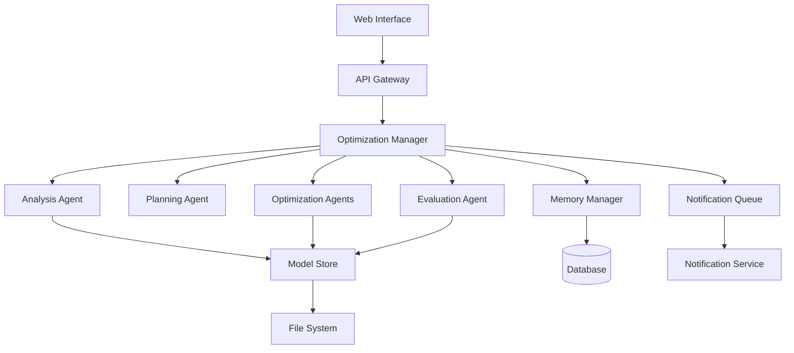

# Design Document

## Overview

The AI Agentic Platform for Robotics Model Optimization is a distributed system that automatically analyzes, optimizes, and evaluates robotics models like OpenVLA. The platform employs a multi-agent architecture where specialized agents handle different aspects of the optimization pipeline: analysis, optimization execution, and evaluation.

The system builds upon the existing OpenVLA planner prototype but extends it into a full-featured platform with sophisticated decision-making capabilities, comprehensive evaluation, and support for multiple optimization techniques.

## Architecture

### High-Level Architecture



### Core Components

1. **Optimization Manager**: Central orchestrator that coordinates all agents and manages the optimization workflow
2. **Analysis Agent**: Analyzes model architecture, performance characteristics, and identifies optimization opportunities
3. **Planning Agent**: Makes intelligent decisions about which optimizations to apply based on configurable criteria
4. **Optimization Agents**: Specialized agents for different optimization techniques (quantization, pruning, distillation, etc.)
5. **Evaluation Agent**: Comprehensive testing and benchmarking of optimized models
6. **Model Store**: Manages model versions, metadata, and optimization history
7. **Memory Manager**: Maintains session state and optimization history for decision-making

## Components and Interfaces

### Analysis Agent

**Purpose**: Analyze uploaded models to identify optimization opportunities

**Key Methods**:
- `analyze_model(model_path: str) -> AnalysisReport`
- `identify_bottlenecks(model: torch.nn.Module) -> List[Bottleneck]`
- `estimate_optimization_impact(model: torch.nn.Module, technique: str) -> ImpactEstimate`

**Analysis Capabilities**:
- Model architecture analysis (layer types, sizes, computational complexity)
- Performance profiling (inference time, memory usage, throughput)
- Compatibility assessment for different optimization techniques
- Hardware-specific optimization opportunities

### Planning Agent

**Purpose**: Make intelligent decisions about optimization strategies

**Key Methods**:
- `plan_optimization(analysis: AnalysisReport, criteria: OptimizationCriteria) -> OptimizationPlan`
- `prioritize_techniques(opportunities: List[OptimizationOpportunity]) -> List[PrioritizedTechnique]`
- `validate_plan(plan: OptimizationPlan) -> ValidationResult`

**Decision Logic**:
- Rule-based system with configurable criteria
- Cost-benefit analysis for each optimization technique
- Constraint satisfaction (performance thresholds, resource limits)
- Risk assessment and rollback planning

### Optimization Agents

**Base Agent Interface**:
```python
class BaseOptimizationAgent:
    def can_optimize(self, model: torch.nn.Module) -> bool
    def estimate_impact(self, model: torch.nn.Module) -> ImpactEstimate
    def optimize(self, model: torch.nn.Module, config: Dict) -> OptimizedModel
    def validate_result(self, original: torch.nn.Module, optimized: torch.nn.Module) -> ValidationResult
```

**Specialized Agents**:
- **QuantizationAgent**: 4-bit, 8-bit, and dynamic quantization using bitsandbytes, AWQ, SmoothQuant
- **PruningAgent**: Structured and unstructured pruning with various sparsity patterns
- **DistillationAgent**: Knowledge distillation to smaller models
- **ArchitectureSearchAgent**: Neural architecture search for optimal model structures
- **CompressionAgent**: Model compression techniques like tensor decomposition

### Evaluation Agent

**Purpose**: Comprehensive evaluation of optimized models

**Key Methods**:
- `evaluate_model(model: torch.nn.Module, benchmarks: List[Benchmark]) -> EvaluationReport`
- `compare_models(original: torch.nn.Module, optimized: torch.nn.Module) -> ComparisonReport`
- `validate_performance(model: torch.nn.Module, thresholds: PerformanceThresholds) -> ValidationResult`

**Evaluation Metrics**:
- Task-specific performance (accuracy, success rate)
- Computational efficiency (inference time, memory usage, FLOPs)
- Hardware compatibility and deployment readiness
- Robustness and stability testing

## Data Models

### Model Metadata
```python
@dataclass
class ModelMetadata:
    id: str
    name: str
    version: str
    model_type: str  # "openvla", "rt1", "custom"
    framework: str   # "pytorch", "tensorflow", "onnx"
    size_mb: float
    parameters: int
    created_at: datetime
    tags: List[str]
```

### Optimization Session
```python
@dataclass
class OptimizationSession:
    id: str
    model_id: str
    status: str  # "running", "completed", "failed", "cancelled"
    criteria: OptimizationCriteria
    plan: OptimizationPlan
    steps: List[OptimizationStep]
    results: Optional[OptimizationResults]
    created_at: datetime
    updated_at: datetime
```

### Analysis Report
```python
@dataclass
class AnalysisReport:
    model_id: str
    architecture_summary: ArchitectureSummary
    performance_profile: PerformanceProfile
    optimization_opportunities: List[OptimizationOpportunity]
    compatibility_matrix: Dict[str, bool]
    recommendations: List[Recommendation]
```

### Evaluation Report
```python
@dataclass
class EvaluationReport:
    model_id: str
    benchmarks: List[BenchmarkResult]
    performance_metrics: PerformanceMetrics
    comparison_baseline: Optional[ComparisonResult]
    validation_status: ValidationStatus
    recommendations: List[str]
```

## Error Handling

### Error Categories
1. **Model Loading Errors**: Invalid format, corrupted files, unsupported architectures
2. **Optimization Errors**: Technique failures, resource constraints, compatibility issues
3. **Evaluation Errors**: Benchmark failures, metric calculation errors, comparison issues
4. **System Errors**: Resource exhaustion, network failures, storage issues

### Error Recovery Strategies
- **Graceful Degradation**: Continue with available optimization techniques if some fail
- **Automatic Rollback**: Revert to previous model state on critical failures
- **Retry Logic**: Configurable retry attempts with exponential backoff
- **Fallback Options**: Alternative optimization paths when primary techniques fail

### Monitoring and Alerting
- Real-time status updates for long-running optimizations
- Progress tracking with estimated completion times
- Alert notifications for failures or performance degradation
- Comprehensive logging for debugging and audit trails

## Testing Strategy

### Unit Testing
- Individual agent functionality testing
- Model loading and validation testing
- Optimization technique correctness testing
- Evaluation metric calculation testing

### Integration Testing
- End-to-end optimization workflow testing
- Agent communication and coordination testing
- Error handling and recovery testing
- Performance regression testing

### Performance Testing
- Optimization speed and efficiency benchmarks
- Memory usage and resource consumption testing
- Scalability testing with multiple concurrent optimizations
- Hardware compatibility testing across different platforms

### Validation Testing
- Model accuracy preservation testing
- Optimization impact verification
- Benchmark consistency testing
- Rollback functionality testing

### Test Data Management
- Synthetic model generation for testing
- Benchmark dataset management
- Test result archival and comparison
- Automated test execution and reporting